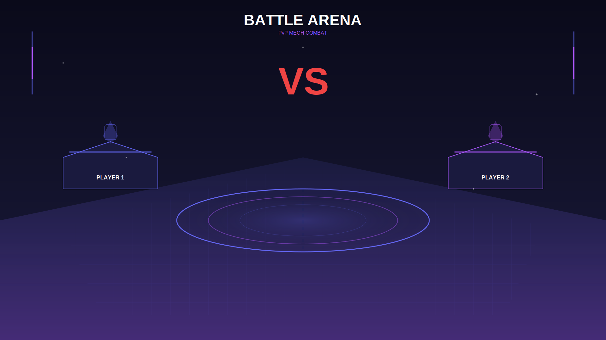

# 🤖 MechForge Web3

A complete Web3 mech battling game with NFTs, PvP battles, and staking rewards on Base Sepolia.



## ✨ Features

- **🎴 NFT Mechs**: Mint unique mech NFTs with random stats and rarities (Common, Uncommon, Rare, Epic, Legendary)
- **⚔️ PvP Battles**: Challenge other players to stake-based battles with ETH prizes
- **💰 Staking**: Stake your mechs to earn FORGE reward tokens
- **📊 Stats System**: Each mech has Attack, Defense, Speed, Health, and Energy stats
- **⬆️ Leveling**: Gain experience from battles to level up and boost stats
- **🎨 Beautiful UI**: Dark cyberpunk theme with animated mech artwork

## 🎮 Mech Types

| Type | Icon | Specialty | Description |
|------|------|-----------|-------------|
| Assault | ⚔️ | Balanced | All-rounder with solid attack and defense |
| Tank | 🛡️ | Defense | High HP and defense, slow but durable |
| Scout | 🚀 | Speed | Fast and agile, hits hard but fragile |
| Sniper | 🎯 | Range | Long-range precision attacks |
| Support | 💚 | Healing | Buffs allies and repairs |

## 🏗️ Architecture

```
┌─────────────────────────────────────────────────────────────┐
│                      React + Vite Frontend                  │
│  - RainbowKit Wallet Connection                             │
│  - wagmi/viem for Web3 interactions                         │
│  - Dark cyberpunk UI theme                                  │
└───────────────────────┬─────────────────────────────────────┘
                        │ Ethers.js / viem
┌───────────────────────▼─────────────────────────────────────┐
│                   Smart Contracts (Solidity)                │
│  ┌──────────────┐  ┌──────────────┐  ┌──────────────────┐   │
│  │   MechNFT    │  │ BattleArena  │  │ StakingRewards   │   │
│  │  ERC-721 NFT │  │  PvP Battles │  │  Stake & Earn    │   │
│  └──────────────┘  └──────────────┘  └──────────────────┘   │
│  ┌────────────────────────────────────────────────────────┐ │
│  │                 ForgeToken (ERC-20)                    │ │
│  └────────────────────────────────────────────────────────┘ │
└─────────────────────────────────────────────────────────────┘
```

## 📋 Contract Addresses (Base Sepolia)

> **Note**: These are placeholder addresses. Run the deployment script to deploy your own contracts.

| Contract | Address | Explorer |
|----------|---------|----------|
| MechNFT | TBD | [View on Basescan]() |
| BattleArena | TBD | [View on Basescan]() |
| StakingRewards | TBD | [View on Basescan]() |
| ForgeToken | TBD | [View on Basescan]() |

## 🚀 Quick Start

### Prerequisites

- Node.js 18+
- A wallet with Base Sepolia ETH ([Get from faucet](https://www.coinbase.com/faucets/base-ethereum-sepolia-faucet))

### Installation

```bash
# Clone the repository
git clone https://github.com/yourusername/mechforge-web3.git
cd mechforge-web3

# Install dependencies
npm install

# Install contract dependencies
cd contracts && npm install
```

### Deploy Contracts

1. Create a `.env` file in the `contracts` folder:

```bash
PRIVATE_KEY=your_private_key_here
BASE_SEPOLIA_RPC=https://sepolia.base.org
BASESCAN_API_KEY=your_basescan_api_key_here
```

2. Deploy to Base Sepolia:

```bash
cd contracts
npm run deploy:testnet
```

3. Update the contract addresses in `frontend/src/config.js`

### Run Frontend Locally

```bash
npm run dev
```

Visit `http://localhost:5173` to play!

## 🎨 Artwork

The game includes 5 unique mech designs and a battle arena background:

- `mech-1-assault.svg` - Legendary Assault mech
- `mech-2-tank.svg` - Rare Tank mech
- `mech-3-scout.svg` - Epic Scout mech
- `mech-4-sniper.svg` - Uncommon Sniper mech
- `mech-5-support.svg` - Common Support mech
- `battle-arena-bg.svg` - PvP battle background

You can generate AI-powered artwork using ComfyUI with the provided workflow.

## 📝 Smart Contract Details

### MechNFT.sol
- ERC-721 NFT with on-chain metadata
- Random stat generation based on rarity
- Level-up system with experience
- Staking status tracking

### BattleArena.sol
- Create and join PvP battles
- ETH staking with winner-takes-all (minus 5% platform fee)
- Multi-round battle resolution
- On-chain battle history

### StakingRewards.sol
- Stake mechs to earn FORGE tokens
- Rarity-based reward multipliers
- Level bonus (1% per level)
- Emergency unlock functionality

### ForgeToken.sol
- ERC-20 reward token
- Mintable by authorized contracts
- 100M max supply

## 🛠️ Tech Stack

- **Frontend**: React 18, Vite, RainbowKit, wagmi, viem
- **Smart Contracts**: Solidity 0.8.20, OpenZeppelin, Hardhat
- **Network**: Base Sepolia (Ethereum L2)
- **Styling**: Custom CSS with cyberpunk theme

## 🌐 Deployment

### Vercel

```bash
npm i -g vercel
vercel --prod
```

### GitNexus

The project includes GitNexus for code intelligence:

```bash
npx gitnexus analyze
npx gitnexus status
```

## 📁 Project Structure

```
mechforge-web3/
├── contracts/           # Solidity smart contracts
│   ├── contracts/
│   │   ├── MechNFT.sol
│   │   ├── BattleArena.sol
│   │   ├── StakingRewards.sol
│   │   ├── ForgeToken.sol
│   │   └── IMechNFT.sol
│   ├── scripts/
│   │   └── deploy.js
│   └── hardhat.config.js
├── frontend/            # React frontend
│   ├── src/
│   │   ├── components/
│   │   ├── App.jsx
│   │   ├── App.css
│   │   └── config.js
│   └── dist/           # Production build
├── artwork/            # Mech SVG artwork
│   ├── mech-1-assault.svg
│   ├── mech-2-tank.svg
│   ├── mech-3-scout.svg
│   ├── mech-4-sniper.svg
│   ├── mech-5-support.svg
│   └── battle-arena-bg.svg
├── README.md
└── package.json
```

## 🎯 Roadmap

- [x] Smart contracts (MechNFT, BattleArena, StakingRewards)
- [x] React frontend with Web3 integration
- [x] 5 mech SVG artworks
- [x] Battle arena background
- [ ] ComfyUI AI-generated mech artwork
- [ ] 3D mech viewer with Three.js
- [ ] Equipment/crafting system
- [ ] Guild battles
- [ ] Mainnet deployment

## 🤝 Contributing

Contributions are welcome! Please feel free to submit a Pull Request.

## 📄 License

MIT License - see LICENSE file for details.

## 🙏 Acknowledgments

- OpenZeppelin for secure smart contract libraries
- RainbowKit for wallet connection UX
- Base for the L2 testnet infrastructure

---

Built with ⚡ by the MechForge Team

**Play now**: [https://mechforge.vercel.app](https://mechforge.vercel.app) (Coming Soon)